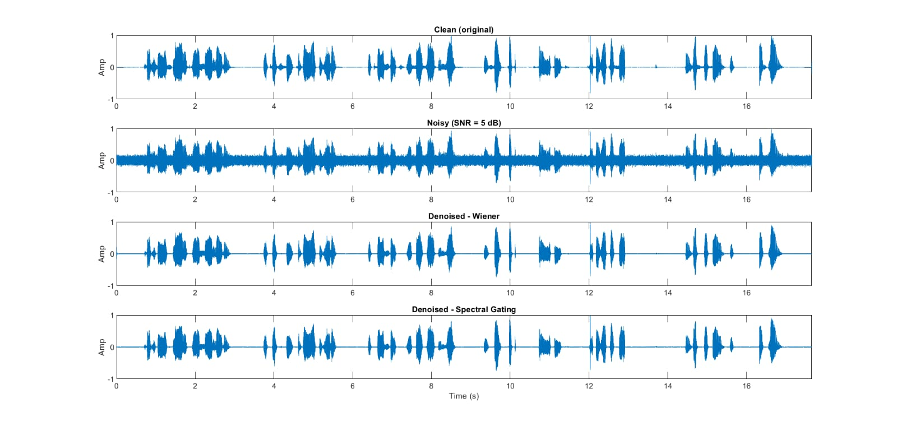
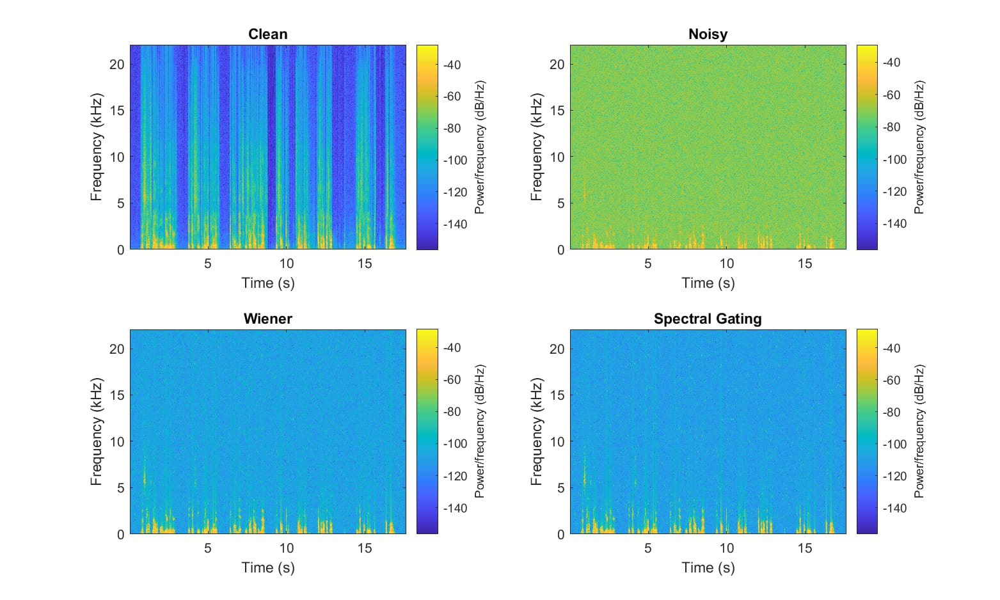

# Audio Noise Reduction

An academic team project focused on speech enhancement and audio noise reduction using Wiener filtering and spectral gating techniques.

## Project Overview

The project implements and compares two audio noise reduction approaches:

- Wiener Filtering
- Spectral Gating

The system processes noisy speech/audio signals and generates denoised outputs while attempting to preserve the quality and clarity of the original speech.

## Objectives

- Reduce unwanted background noise from audio signals.
- Improve speech clarity and quality.
- Analyze noisy and denoised signals in both time and frequency domains.
- Compare the performance of Wiener filtering and spectral gating.
- Visualize the effect of noise reduction using waveforms and spectrograms.

## Methodology

The audio processing workflow consists of:

1. Audio input and normalization
2. Framing and windowing of the audio signal
3. Noise estimation
4. Short-Time Fourier Transform (STFT)
5. Wiener filtering
6. Spectral gating
7. Inverse STFT reconstruction
8. Denoised audio generation
9. Waveform and spectrogram comparison

## Techniques Used

### Wiener Filtering

Wiener filtering estimates the relationship between the desired signal and noise and applies a frequency-dependent gain to suppress unwanted noise while preserving useful speech components.

### Spectral Gating

Spectral gating suppresses frequency components that are estimated to be dominated by noise. A gain floor is applied to avoid completely eliminating low-energy speech components.

## Technologies Used

- MATLAB
- Digital Signal Processing (DSP)
- Fast Fourier Transform (FFT)
- Short-Time Fourier Transform (STFT)
- Wiener Filtering
- Spectral Gating
- Audio Signal Processing

## Project Results

### Waveform Comparison

The waveform comparison shows the original clean speech, noisy speech, and the outputs after Wiener filtering and spectral gating.



### Spectrogram Comparison

The spectrogram comparison visualizes the distribution of signal energy across time and frequency before and after noise reduction.



## Project Structure

```text
audio-noise-reduction/
│
├── README.md
│
├── images/
│   ├── waveform-comparison.jpg
│   └── spectrogram-comparison.jpg
│
└── src/
    └── noise_reduction_wiener_spectral_gating.m
